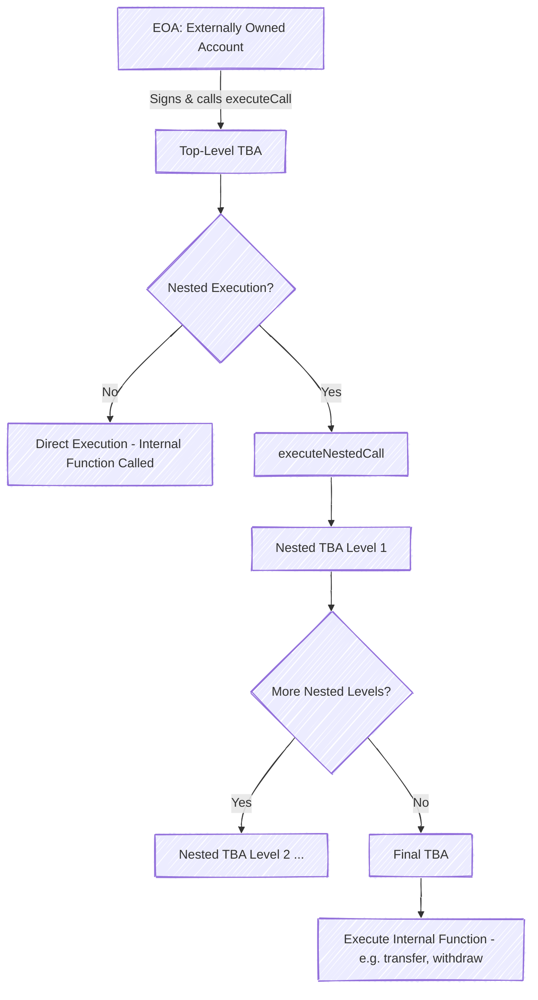

# InHaus NFT's Token Bound Account (TBA) Smart Wallet using ERC‑6551  
### Nfts with thier own wallets controlled by the nft owner
## 1. Overview

The ERC‑6551 TBA application is a decentralized solution that transforms non-fungible tokens (NFTs) into fully functional smart wallets. In this system, every NFT can own its own wallet – a Token Bound Account – which securely holds and manages assets such as native ETH, ERC‑20 tokens, and even other NFTs. The key innovation is that these smart wallets are “bound” to the NFT, which means that the ownership of the NFT (an externally owned account, or EOA) is inextricably linked to the corresponding wallet account. This design enables a wide range of use cases, including gaming assets, digital gift cards, advanced wallets, loot boxes, and even complex asset management systems like tracking the components of an real world asset.

## 2. Key Concepts & Terminology

### Externally Owned Account (EOA)
- **Definition:** A regular user wallet address that is controlled by a private key.
- **Role in the Application:** The EOA is the original owner of an NFT and is responsible for signing transactions. In our system, the EOA ultimately controls the TBA, since the NFT (owned by the EOA) is linked to a smart wallet.

### Token Bound Account (TBA)
- **Definition:** A smart contract wallet that is “bound” to a specific NFT. Its functionality and control are derived directly from the NFT.
- **Functionality:**  
  - Can store and manage native tokens (ETH), ERC‑20 tokens, and other NFTs.  
  - Provides functions such as transfer, withdraw, top up, and claim.  
  - Supports nested execution calls, allowing more complex account hierarchies.
- **Ownership Model:**  
  - The NFT is the identifier for a TBA.  
  - Since the NFT is owned by an EOA, the EOA is ultimately the wallet’s owner and signer.  
  - This design provides security by ensuring that only the EOA can perform sensitive actions (such as withdrawals or transfers) with the wallet's assets.

### Nested Token Bound Accounts
- **Concept:** TBAs can be nested. For example, an NFT could own a wallet (TBA Level 1), and that wallet (or another NFT it contains) can in turn have its own smart wallet (TBA Level 2).  
- **Benefits:**  
  - Allows for layered account structures where multiple levels of execution and permission are supported.  
  - Useful in complex dapps (e.g., gaming or asset management) where assets are organized hierarchically.

### Smart Accounts and Asset Ownership
- **Smart Account:** In our application, the smart account is the TBA. It is unique in that the NFT it is bound to serves as its identifier.
- **Asset Ownership:**  
  - The EOA owns the NFT, and therefore indirectly controls the TBA.  
  - As a result, actions like withdraw, claim, transfer, and top up are authorized by the EOA through the TBA.  
  - This linkage is enforced by the smart contract logic so that, for example, withdraw or transfer functions only execute if the signer is the NFT owner (i.e., the EOA).

## 3. How the NFT Wallets Work

### The Relationship: EOA, NFT, and TBA
- **Externally Owned Account (EOA):**  
  - This is the user’s wallet (like MetaMask).  
  - The EOA is the signer for all blockchain transactions.
- **Non-Fungible Token (NFT):**  
  - Each NFT represents an asset, such as a game item, collectible, or even a digital gift card.
  - In our system, every NFT is enhanced to become an asset that owns a smart account—a Token Bound Account.
- **Token Bound Account (TBA):**  
  - The TBA is a smart wallet contract created specifically for an NFT.
  - Only the NFT owner (the EOA) is permitted to execute important functions in the TBA.
  - Functions like withdraw, transfer, and claim are available so that the NFT wallet can manage native ETH, ERC‑20 tokens, and NFT assets.

### Nested Token Bound Accounts
- **Nested TBAs:**  
  - The system supports nested TBAs where one NFT’s smart wallet might itself interact with other TBAs.
  - This nested approach can be used in complex scenarios like gaming (where in-game items may have sub-items) or in product cataloging (a car NFT with separate TBAs for each of its components).
- **Function Flow:**  
  - For a nested TBA, the smart contract employs recursive calls to execute actions through multiple levels.
  - The EOA signs only the initial transaction. Intermediate TBAs pass the call along to the next level until the final action is executed.

#### Nested TBA Execution
- **Recursive Execution via `executeNestedCall`:**
  - For more complex scenarios, the system supports nested TBAs.
  - The EOA initiates a transaction (signed by the EOA) that passes an ordered list (array) of TBA addresses.
  - **Execution Steps:**
    1. The top‑level TBA receives the call along with the array of nested TBAs.
    2. It validates that the caller is the NFT owner.
    3. The call is then forwarded sequentially by each nested TBA until reaching the final, deepest TBA.
    4. The final TBA executes the internal function (such as transferring an NFT) without a re‑check, trusting the top‑level validation.

- **Benefits:**
  - **Layered Control:** Multiple layers allow, for example, an NFT to own a wallet that, in turn, delegates specific functions to nested sub‑wallets.
  - **Efficient Forwarding:** Only the top‑level call requires the full ownership check; intermediate TBAs simply forward the call.

## 4. User Interaction & Features

### Wallet Overview

- **Summary Tab:**  
  - Displays native ETH balance in its own centered card.
  - Shows a preview grid (up to 10 cards) of ERC‑20 tokens in a row (with 5 columns on medium+ screens).
  - Provides an NFT preview section (up to 10 NFTs in a responsive grid with 5 per row) with a “View All NFTs” link.

- **Balances Tab (Detailed View):**  
  - A table view where each row (rendered by the `BalanceRow` component) includes:
    - An icon (or “ETH” text for native tokens),
    - Token name and balance,
    - Two action buttons: **Copy** (to copy the token’s address) and **Send** (to trigger the corresponding send modal).

- **NFTs Tab:**  
  - Displays all NFTs owned by the connected wallet using a responsive grid.
  - Each NFT card shows a hover overlay with three buttons:
    - **View NFT:** Opens a modal showing the NFT image and details.
    - **Transfer NFT:** Opens a modal to initiate an NFT transfer using the standard `transferFrom` function.
    - **Open NFT Account:** Navigates to a dedicated page for the NFT’s associated wallet.

- **Contracts Tab:**  
  - Currently a placeholder for future contract interaction features.

### Key Actions & Buttons
- **Send/Transfer Buttons:**  
  - Native and ERC‑20 tokens include “Send” buttons that open transfer modals.
  - NFT cards include buttons for transferring NFTs (via `transferFrom`) and opening NFT accounts.
- **Copy Buttons:**  
  - In the detailed balances view, each row includes a **Copy** button that copies the token’s contract address.

## 5. Security & Account Management

### Ownership & Signing Authority
- **EOA Ownership:**  
   - The externally owned account (EOA) of the user owns the NFT, and therefore is the ultimate owner and signer of the TBA.
  - Sensitive functions (withdrawals, transfers) in the TBA smart contracts are gated with checks to confirm that the transaction signer is the NFT owner.

### Account Generation and Registry
- **Registry Contract:**  
  - A central registry smart contract is used to create and manage TBAs.
  - Unique salts and parameters are used during account creation to guarantee deterministic TBA addresses.

### Nested Account Security
- **Recursive Execution:**  
  - Nested TBAs use recursive execution functions, where only the top-level EOA is required to sign the initial call. Intermediate TBAs act only as forwarders.

### Retrofitting Existing NFTs
- **Adding TBA Functionality:**  
  - The dApp can retrofit pre-existing NFTs with TBA functionality through the registry, linking the NFT to a newly created TBA.

### Functionality & Controls
- **Withdraw, Claim, Send, Topup & Receive:**  
  - Withdraw/Claim functions move assets from a TBA back to the EOA.
  - Send functions enable transferring assets (native tokens, ERC‑20, or NFTs) from the wallet.
  - Topup and Receive buttons allow users to add funds to the wallet and view a QR code of their TBA address.

### Token Balances & User Interfaces
- **User EOA Wallet Component:**  
  - Displays the connected wallet’s live balances, NFT holdings, and provides interactions for sending assets.
- **TBA Account Component:**  
  - Represents the smart wallet linked to an NFT, with functionality to manage assets stored in the TBA.

## 6. Use Cases

### Gaming
- **In-game Asset Management:**  
  - NFTs can represent characters or items, each with its own TBA for storing in-game currencies and assets.
- **Nested Assets:**  
  - Nested TBAs allow for highly sophisticated inventories where items (and sub-items) have separate wallets.

### Gift Cards & Wallets
- **Digital Gift Cards:**  
  - NFTs can serve as gift cards with a TBA holding a specific value.
- **Personal Wallets:**  
  - TBAs offer an enhanced wallet experience where ownership of the NFT guarantees control over the associated assets.

### Loot Boxes & Stats/Points Systems
- **Loot Boxes:**  
  - TBAs can manage randomized rewards and be used in systems that distribute loot boxes.
- **Point Systems & Rewards:**  
  - NFT wallets can integrate with gamified systems for tracking points, stats, and unlockables.

### Asset Databasing (e.g., Car & Its Parts)
- **Digital Twins:**  
  - An NFT can represent a high-value asset (like a car) with its TBA storing information about maintenance, ownership history, and even individual parts (nested accounts can represent components).

## 7. Conclusion & Future Enhancements

Status of the ERC‑6551 application:
- Smart contracts have been enhanced to support token-bound accounts and nested execution.
- A complete user interface has been built for NFT wallet interactions and a comprehensive wallet overview that shows balances, tokens, and NFTs.
- The user interface is highly responsive and modular, featuring a Summary tab (combining balances and NFT previews), a detailed Balances tab with copy and send functionality, and an NFT tab with full NFT views and interactions.
- The application is designed to be flexible and retrofittable—allowing existing NFTs to be linked with TBAs—thus opening up various use cases such as gaming, gift cards, digital wallets, loot boxes, and product inventory systems.

Future enhancements include further expansion of the Contracts tab to enable more advanced interactions, additional security audits, and deeper integration with use cases such as decentralized gaming, asset tracking, and dynamic reward systems.

